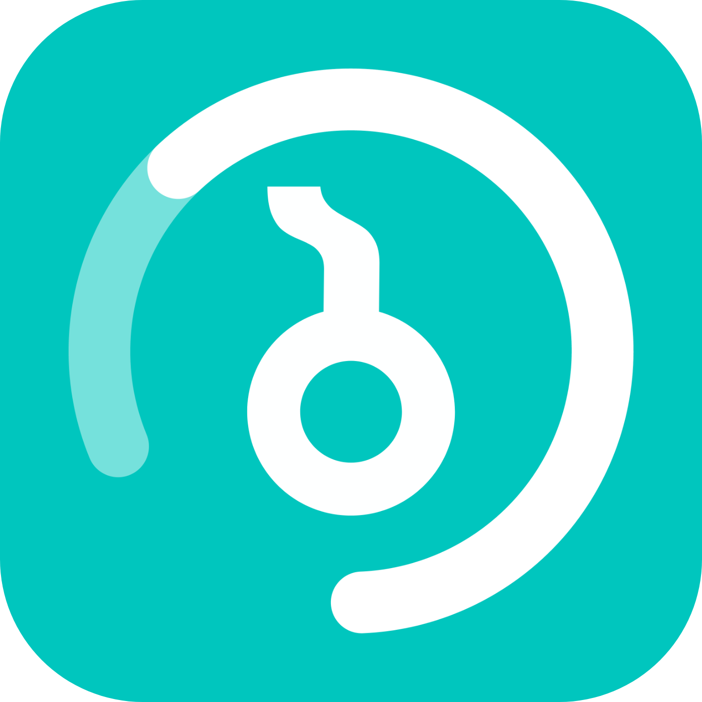

# Projects
## Borbalo

Borbalo is a smart app designed to simplify vehicle management for drivers in Georgia. It tracks fines, sends reminders, and offers easy payment options, while also providing real-time updates from government agencies. With hundreds of thousands of users, Borbalo is a go-to platform for staying informed about vehicle-related obligations, and it offers additional features like corporate services and a digital discount card for subscribers.

| **Attribute**       | **Details**                                                             |
|---------------------|-------------------------------------------------------------------------|
| **Parent Company**   | KJ Group                                                                |
| **Release Date**     | October 12, 2022                                                        |
| **Website**          | [borbalo.ge](https://borbalo.ge)                                        |
| **# of Employees**   | 10-20                                                                   |

> The website is also available in English.

### My Participation
For Borbalo, the idea came from watching my father struggle with forgetting fines and ending up paying three times the amount. I designed everything in Adobe XD, from radar alerts to payment reminders, and even negotiated with the government to integrate official systems. I also managed the business side and pulled the team together to build the app.

## VEF

VEF (Vefxistyaosani) is an app designed to help students understand “The Knight in the Panther’s Skin,” which is written in Old Georgian, much like how Shakespeare is in Old English. The app uses a unique learning method where the poem is split into Rustaveli quarters, and users can swipe on any part to see a modern Georgian translation. Our research has shown that students swipe less as they read, indicating progress. It has become the go-to app for students in Georgia, often surpassing popular apps like PhotoMath and Duolingo during study seasons.

| **Attribute**       | **Details**                                                                 |
|---------------------|-----------------------------------------------------------------------------|
| **Parent Company**   | KJ Group                                                                    |
| **Release Date**     | October 20, 2020                                                            |
| **App Store Page**   | [Vefxistyaosani](https://apps.apple.com/ge/app/vefxistyaosani/id1494639788) |
| **# of Employees**   | 1-5                                                                         |

### My Participation
For Vefxistyaosani, I noticed how tough it was for students to understand the Old Georgian text. I came up translation swipe feature, worked on the translations, and designed the entire app. 

> I haven't wokred on the code for any of the apps.